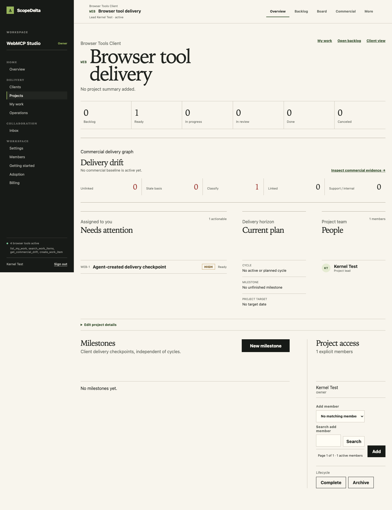
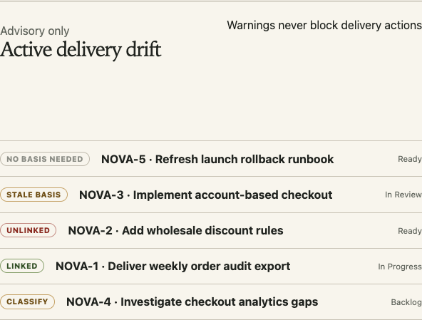
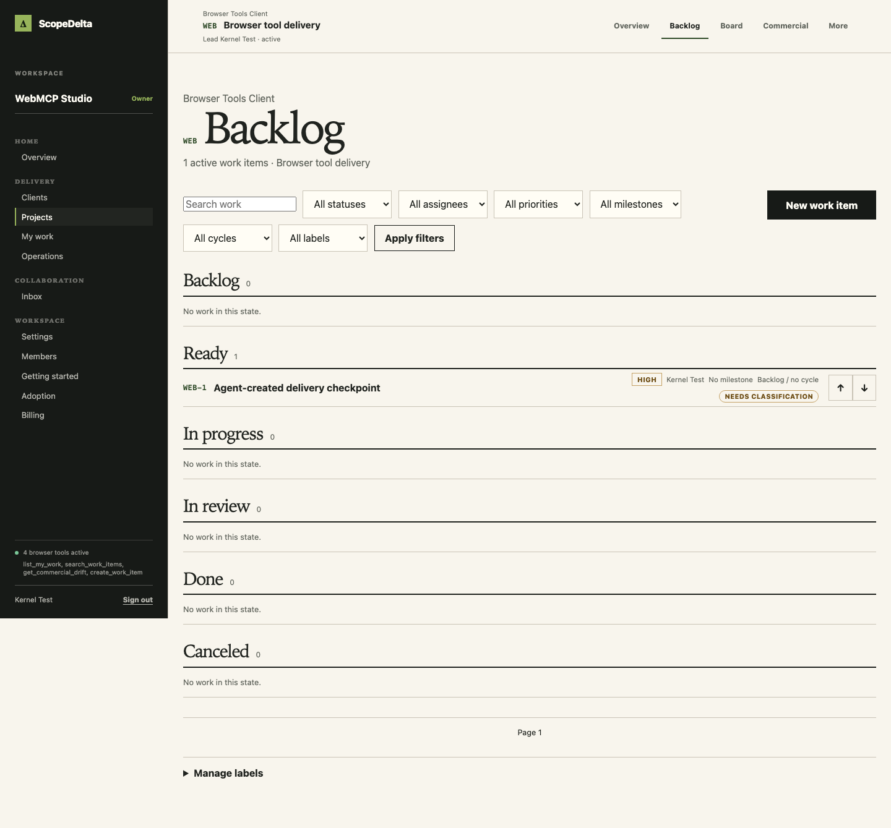
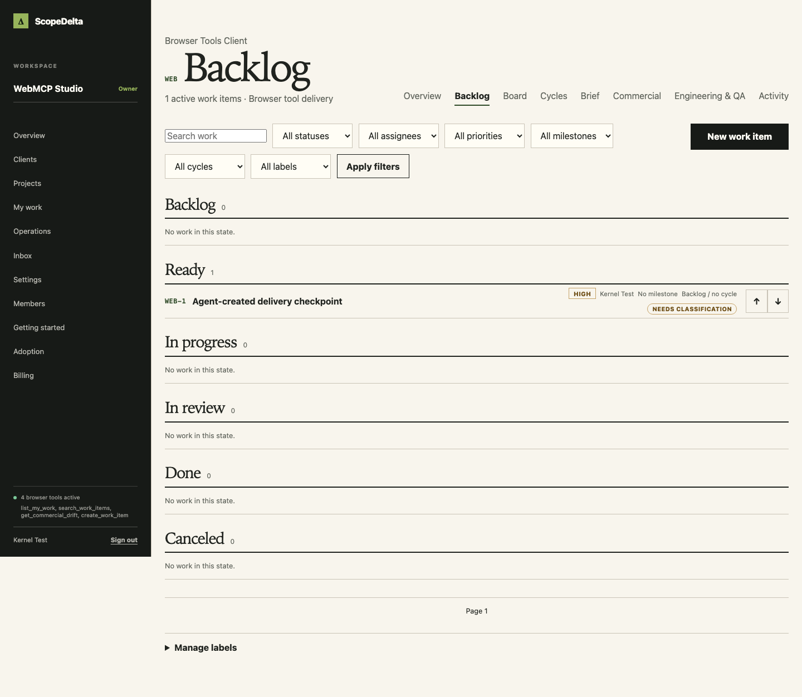

# WEBMCP-001 — Existing ScopeDelta Workflows as Browser Tools

## HACK-002 judge-facing workflow

HACK-002 adds a role-aware project command center and coherent project navigation without changing the four WebMCP names, schemas, authorization rules, fixture semantics, or commercial meaning. The persistent project bar identifies the client, project, lead, lifecycle, and active surface; Overview, Backlog, Board, and manager-only Commercial remain primary, while Cycles, Brief, Client, Engineering & QA, AI, and Activity live in a keyboard-accessible secondary menu. Workspace navigation is grouped into Home, Delivery, Collaboration, and Workspace administration with active-route semantics and a compact narrow-screen menu.

The NOVA opening shot is now the project command center. It shows assigned attention work, delivery-state counts, current cycle and nearest unfinished milestone, lead and member presence, current baseline context, and the authoritative five-category drift snapshot. Ordinary members receive the same delivery command center without commercial facts or controls. Project editing, milestones, membership, and lifecycle controls remain below the operational summary in restrained disclosures.

Authenticated workspace and project route segments include accessible loading fallbacks. Project links also announce immediate pending navigation so feedback is available before a delayed server response. Request-scoped React `cache()` wrappers reuse session actor, workspace, and project resolution across layouts and every project page; no cross-request tenant data cache is used.

### Combined drift summary

`GET /api/v1/workspaces/:workspaceId/projects/:projectId/commercial/drift-summary?limit=1..5` returns exact counts for `linked`, `stale_basis`, `commercially_unlinked`, `needs_classification`, and `support_internal`, newest affected work from only the unlinked/unclassified/stale categories, and lightweight current-baseline context. It preserves the owner/admin/project-lead boundary and never returns commercial source bodies.

`get_commercial_drift` now performs one authorized project lookup and one drift-summary request instead of five drift HTTP requests. Its model-visible envelope is unchanged. The Commercial page and command center use the same snapshot; the existing paginated drift route remains the detailed ledger.

Local review-candidate evidence on August 30, 2026:

- TypeScript, production build, and 173 unit/component tests passed.
- Focused delivery and commercial integration suites passed, including owner/admin/lead/member/non-member command-center access and five-filter snapshot parity.
- Production-mode Chromium delivery navigation passed in 18.6 seconds end to end; the four-tool WebMCP create/read journey passed in 7.6 seconds end to end.
- The initial public sign-in baseline was 1.620 seconds cold and 1.145–1.478 seconds warm. Exact authenticated cold/warm route transitions, under-200 ms feedback observations, and deployed ≤1.5 second warm targets must be recorded against the final deployed SHA; local suite duration is not presented as route latency.

## HACK-001 judge-ready deployment

The judging URL is [https://scopedelta.netlify.app](https://scopedelta.netlify.app). HACK-001 starts from the post-PR-#59 `main` SHA `f18eb4a049b420904dcd22363f950104492f9e46` and adds deterministic demo operations and evidence only. It does not add a migration, HTTP API, authentication bypass, provider integration, fifth tool, or tool contract change.

The isolated synthetic fixture is reserved by both markers:

- Workspace: `ScopeDelta WebMCP Judge Demo`
- Workspace slug: `webmcp-judge-demo`
- Credentialless owner: a fixed synthetic `.test` identity
- Judge: a private, verified `.test` credential identity with workspace role `member` and project-lead responsibility for `NOVA`

The private judge email and password must never be printed, committed, copied into screenshots, or added to issues or pull requests.

### Seed, verify, and reset

Supply the existing target database connection and existing 32+ character `BETTER_AUTH_SECRET` through the normal protected environment, then set the following values in the process environment or an untracked `.env.local`:

```dotenv
WEBMCP_DEMO_ENABLE=webmcp-challenge-2026
WEBMCP_DEMO_JUDGE_EMAIL=<private-judge-address-ending-in-.test>
WEBMCP_DEMO_JUDGE_PASSWORD=<private-16-to-128-character-password>
```

Run the idempotent seed and secret-free verification:

```bash
pnpm webmcp:demo seed
pnpm webmcp:demo verify
```

Successful output contains only the command, reserved workspace/project markers, verified role/credential booleans, assigned-work count, category counts, and pristine-state booleans. It never contains the email, password, password hash, cookie, token, or database identifier.

Reset is destructive only to the exact guarded fixture and immediately reseeds it. It requires one additional confirmation marker:

```dotenv
WEBMCP_DEMO_RESET_CONFIRM=reset-webmcp-judge-demo
```

```bash
pnpm webmcp:demo reset
pnpm webmcp:demo verify
```

Reset refuses to run unless the exact workspace name and slug, fixed fixture identities, owner/member roles, two-member workspace boundary, judge email, judge credential, and absence of unrelated workspace memberships all match. The scoped deletion runs in one transaction. Because audit rows are intentionally immutable, reset takes an exclusive audit-table lock, temporarily disables only the immutability trigger, deletes audit rows for the guarded workspace, reenables the trigger, deletes the workspace, and commits; any failure rolls the entire operation back. Fixture identities remain available for the immediate reseed.

### Deterministic NOVA scenario

The seed uses ordinary ScopeDelta domain services for the client, project, milestone, cycle, work, commercial sources, baselines, scope revisions, activation, and basis links. Direct database access is limited to fixture identities, the Better Auth credential, membership bootstrap, reserved slug, verification queries, and guarded deletion. The reserved slug is promoted only after all fixture writes succeed. If provisioning stops earlier, a later seed can delete and recreate only an exact generated-slug fixture whose synthetic identities, credential, ownership, membership subset, and workspace isolation checks still pass; unexpected members or markers are refused.

| Synthetic record | Deterministic value         |
| ---------------- | --------------------------- |
| Client           | `Northstar Retail`          |
| Project          | `NOVA — Checkout Recovery`  |
| Milestone        | `September Checkout Launch` |
| Cycle            | `Judge Demo Cycle`          |
| Judge assignment | All five base work items    |

The pristine drift ledger contains exactly one item in each factual category:

| Category                | Work item                             | Basis construction                                                                                                         |
| ----------------------- | ------------------------------------- | -------------------------------------------------------------------------------------------------------------------------- |
| `linked`                | `Deliver weekly order audit export`   | Linked to an unchanged scope revision in the effective baseline.                                                           |
| `stale_basis`           | `Implement account-based checkout`    | Linked to the first effective baseline; a later real amendment revises checkout to include SSO and approval audit history. |
| `commercially_unlinked` | `Add wholesale discount rules`        | Classified as client delivery with no commercial basis link.                                                               |
| `needs_classification`  | `Investigate checkout analytics gaps` | Retains the normal unclassified work purpose.                                                                              |
| `support_internal`      | `Refresh launch rollback runbook`     | Classified as delivery support.                                                                                            |

The amendment also retires the carried-forward legacy dashboard scope. No classification is edited to manufacture stale basis.

### Exact natural-language judge prompts

Run each prompt in a fresh ChatGPT in-app-browser session and in Chrome 149 or newer with WebMCP testing enabled:

1. “What assigned work needs my attention?”
2. “In project NOVA, find the wholesale discount work.”
3. “Why is delivery drifting from the current commercial agreement in NOVA? Give me the factual category counts and affected work.”
4. “In NOVA, create a high-priority work item titled ‘Confirm wholesale change-order review’ and assign it to me.”

Expected tool selection is `list_my_work`, `search_work_items`, `get_commercial_drift`, and `create_work_item`, respectively. Preserve the existing names and schemas. If and only if a fresh-session selection failure is reproduced, add the corresponding disambiguating “Use when…” sentence to that existing tool description and rerun the focused WebMCP suite. Do not add a fifth tool.

After prompt 4, confirm `Confirm wholesale change-order review` appears in the ordinary backlog/My Work UI. A second execution must not be used to compensate for an ambiguous write; search first. Reset before repeating the recorded demo.

### Exact-SHA live evidence checklist

Record the following in the HACK-001 pull request for the final deployed SHA without including private credentials or database IDs:

- Deployed commit SHA and Netlify production-deploy result.
- HTTPS response containing `Origin-Agent-Cluster: ?1` and `Permissions-Policy: tools=(self)`.
- Exactly four active tools before and after refresh, with no duplicate registrations.
- Prompt-to-tool mapping for all four fresh-session prompts.
- One item in each of the five NOVA drift categories before the write.
- Created work item visible through the tool response and ordinary UI.
- Unsupported-browser UI remains usable and reports browser tools unavailable.
- Cold and warm observations for sign-in-to-first-result, drift result, and creation-to-visible-UI paths.
- Repository-safe screenshots of the four-tool inspector, commercial drift ledger, and created item. Crop or redact all browser/account chrome that could reveal the private judge identity.

At the recorded baseline SHA, the live sign-in response was verified on August 30, 2026 to include both required headers. Final-candidate tool-selection, mutation, screenshots, performance, and post-merge production evidence must be recorded against the later exact SHA rather than inferred from this baseline check.

Local repository-safe evidence from the HACK-001 fixture:







The existing four-tool registration capture remains at `docs/screenshots/webmcp-browser-tools.png`. Replace or supplement it with the exact deployed NOVA session when Chrome 149+ final-candidate evidence is recorded.

### Challenge provenance and limitations

The challenge entry combines ScopeDelta’s pre-existing delivery/commercial domain with the WebMCP adapter delivered by WEBMCP-001 and the deterministic judge operations delivered by HACK-001. Existing domain services remain authoritative. The seeded data is wholly synthetic and isolated from customer workspaces.

WebMCP remains an emerging browser capability. Unsupported browsers get the normal ScopeDelta UI without tools. Natural-language selection is agent/browser-dependent and must be demonstrated in fresh sessions. Drift is factual and advisory; it is not a legal, contractual, or monetary conclusion. Devpost registration, eligibility attestation, private credential entry, public demo video, final submission, public-repository status, and license/legal clearance remain founder actions. [LIC-001](https://github.com/Jainil2/scopedelta/issues/19) remains a blocker; HACK-001 does not publish the repository or add/change its license.

## Inventory

This inventory was published as the first implementation comment on [issue #55](https://github.com/Jainil2/scopedelta/issues/55#issuecomment-5436230533) before WebMCP code was added.

| Existing user capability           | Existing UI                                                                                                                                 | Existing server/domain                              | Existing endpoint                                                                  | Class | Decision                                                                                                                                        |
| ---------------------------------- | ------------------------------------------------------------------------------------------------------------------------------------------- | --------------------------------------------------- | ---------------------------------------------------------------------------------- | ----- | ----------------------------------------------------------------------------------------------------------------------------------------------- |
| See actionable work assigned to me | `MyWorkPage` / `loadMyWork` in `src/app/app/[workspaceSlug]/my-work/page.tsx`; `MyWorkWorkspace` in `src/components/planning-workspace.tsx` | `listMyWork` in `src/server/delivery.ts`            | `GET /api/v1/workspaces/:workspaceId/my-work`                                      | READ  | Keep as `list_my_work`; already bounded by active projects, assignment, membership, and workspace authorization.                                |
| Search/filter project work items   | `BacklogPage` / `loadBacklog`; `BacklogWorkspace` filters in `src/components/delivery-workspace.tsx`                                        | `listWorkItems` in `src/server/delivery.ts`         | `GET /api/v1/workspaces/:workspaceId/projects/:projectId/work-items`               | READ  | Keep as `search_work_items`; reuse a model-friendly subset of existing filters.                                                                 |
| Review commercial-delivery drift   | `CommercialPage` / `loadCommercial`; `DriftLedger` in `src/components/commercial-workspace.tsx`                                             | `listCommercialDrift` in `src/server/commercial.ts` | `GET /api/v1/workspaces/:workspaceId/projects/:projectId/commercial/drift`         | READ  | Keep as `get_commercial_drift`; preserves manager authorization and authoritative drift categories without exposing source bodies.              |
| Create normal delivery work        | `BacklogWorkspace.create`, `WorkItemForm`, and `workItemPayload` in `src/components/delivery-workspace.tsx`                                 | `createWorkItem` in `src/server/delivery.ts`        | `POST /api/v1/workspaces/:workspaceId/projects/:projectId/work-items`              | WRITE | Keep as `create_work_item`; preserves validation, entitlement checks, numbering, audits, assignment events, and UI refresh behavior.            |
| Move work through workflow status  | `MyWorkWorkspace.changeStatus` and `BoardWorkspace.patch` in `src/components/planning-workspace.tsx`                                        | `updateWorkItem` in `src/server/delivery.ts`        | `PATCH /api/v1/workspaces/:workspaceId/projects/:projectId/work-items/:workItemId` | WRITE | Drop from v1; it overlaps the existing board/My Work workflow and adds mutation risk without materially improving the four-step challenge demo. |

## Browser tool mapping

The authenticated workspace shell exposes exactly four imperative WebMCP tools. The adapter in `src/webmcp.ts` calls existing same-origin `/api/v1` endpoints with the user's existing browser session; it does not add an agent backend or a new business operation.

| Tool                   | Existing route(s)                                                                                    | Projection                                                                                                                                          |
| ---------------------- | ---------------------------------------------------------------------------------------------------- | --------------------------------------------------------------------------------------------------------------------------------------------------- |
| `list_my_work`         | `GET /api/v1/workspaces/:workspaceId/my-work`                                                        | Assigned actionable work with stable identifiers, bounded titles, project/client context, delivery state, dates, purpose, and factual basis counts. |
| `search_work_items`    | Authorized project lookup, then `GET /api/v1/workspaces/:workspaceId/projects/:projectId/work-items` | A compact subset of existing project work-item facts.                                                                                               |
| `get_commercial_drift` | Authorized project lookup, then one `GET .../commercial/drift-summary?limit=1..5` request            | Category totals and the most recently updated affected items. The result is explicitly advisory and provides no contractual or monetary verdict.    |
| `create_work_item`     | Authorized project lookup, then existing work-item POST                                              | Stable created identifier, title, project key, status, priority, and whether UI refresh was requested.                                              |

All inputs use strict object schemas with described properties, required fields, existing status/priority enums, and `additionalProperties: false`. Read tools are marked read-only and untrusted; the write is marked untrusted but not read-only. Outputs omit descriptions, comments, commercial source text, and opaque relationship IDs. Serialized read results are limited to 1,500 characters by bounding text and accepting projected records only while the complete envelope remains within budget.

## Registration lifecycle

`WebMcpBridge` lives in the authenticated workspace shell and passes only the current workspace ID and session user ID to the registry. Registration prefers `document.modelContext` and makes one compatibility fallback to `navigator.modelContext`.

The active registry is stored on `document` under a `Symbol.for(...)` key. A remount, workspace change, Strict Mode replay, or hot reload aborts the old registry before a new one starts. Each tool owns a separate `AbortController`, each `registerTool()` promise is awaited, and one registration failure does not suppress the others. Successful names are reconciled through `getTools()`; tracked awaited successes are the fallback when discovery is unavailable. A small sidebar indicator reports unavailable, registering, or the exact active count and names.

Execution cancellation is passed through project resolution and read endpoint fetches. Once project resolution succeeds, `create_work_item` deliberately does not bind the POST to the execution signal and never retries an ambiguous response. Its safe error tells the caller to search before retrying, which avoids accidental duplicates. A confirmed create invokes the same `router.refresh()` mechanism used by the authenticated UI.

## Authorization and privacy

- The model supplies a human-readable `project_key`, never a database project ID.
- Every project-scoped execution first queries the existing authorized active-project endpoint and exact-matches the normalized key. The subsequent project endpoint still performs authoritative authorization, covering access changes between requests.
- `list_my_work` retains its current workspace membership, active project/client, assignment, and actionable-status constraints.
- Commercial drift retains manager-only authorization and returns factual category state rather than underlying source bodies.
- Creation retains existing validation, entitlement, numbering, audit, assignment-event, and workspace/project checks.
- Safe errors distinguish authentication, access/not-found, conflicts, cancellation, and availability without copying arbitrary response bodies into model context.

## Response headers

Every Next response adds:

```text
Origin-Agent-Cluster: ?1
Permissions-Policy: tools=(self)
```

The same headers are declared in `netlify.toml` for static/file responses. Both locations are intentional: Netlify file-based custom headers do not cover every SSR or function response, while Next response headers do.

Verify locally or against a deployed URL:

```bash
curl --head http://localhost:3000/sign-in
curl --head https://YOUR-DEPLOYMENT.example/app/YOUR-WORKSPACE
```

## Automated verification

Run focused checks first:

```bash
pnpm exec vitest run src/webmcp.test.ts src/components/app-shell.test.tsx src/lib/client-security-headers.test.ts
pnpm typecheck
pnpm lint
pnpm exec playwright test e2e/platform-kernel.spec.ts -g "authenticated workspace exposes existing workflows"
```

The WebMCP unit suite covers context absence and preference, navigator fallback, sequential awaited registration, isolated failure, `getTools()` reconciliation and fallback, stale registry races, one signal per tool, cleanup, strict schemas/annotations, input validation, exact project resolution, all execution projections, output bounds, cancellation, safe HTTP failures, ambiguous create responses, and refresh/no-refresh behavior.

## Demo journey

1. Sign in and open an authenticated workspace in Chrome 149 or newer.
2. Enable `chrome://flags/#enable-webmcp-testing`, reload Chrome, and open the Model Context Tool Inspector.
3. Confirm the sidebar shows `4 browser tools active` and lists `list_my_work`, `search_work_items`, `get_commercial_drift`, and `create_work_item` exactly once.
4. Ask for your assigned work and search an active project by its visible key.
5. As a workspace owner or admin, ask for that project's commercial drift and confirm the answer remains advisory.
6. Create a work item with `assign_to_me: true`. Confirm the returned identifier appears in the ordinary backlog and My Work UI without a manual page reload.
7. Navigate or refresh and verify the inspector still contains one registration for each tool.
8. Repeat in an unsupported browser and confirm ScopeDelta remains usable while the indicator reports browser tools unavailable.
9. Where available, repeat natural-language tool selection in ChatGPT's in-app browser.



## Compatibility and provenance boundary

WebMCP is an emerging browser API. ScopeDelta does not ship a polyfill; unsupported browsers degrade without affecting normal UI workflows. The implementation targets the current imperative `document.modelContext` API, retains the documented navigator fallback, and follows current [Chrome registration guidance](https://developer.chrome.com/docs/ai/webmcp/imperative-api) and [tool security guidance](https://developer.chrome.com/docs/ai/webmcp/secure-tools).

All server/domain capabilities, authorization rules, API routes, UI workflows, persistence, audits, and commercial classifications in this document pre-date WEBMCP-001. The challenge contribution is limited to the browser-side protocol adapter, registration/status bridge, isolation headers, tests, and this evidence document. It adds no database migration, privileged agent service, public-repository action, license change, or new business capability.
