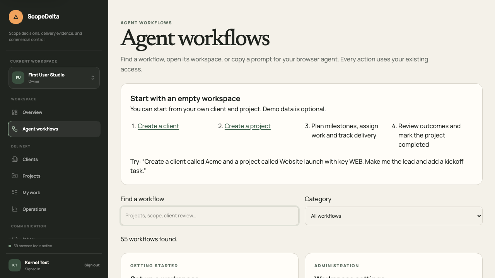
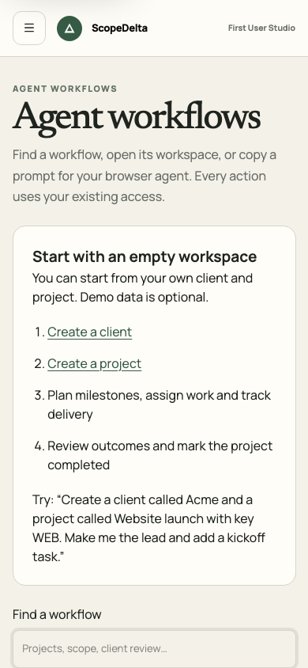

# Workflow validation evidence

Implementation: [WEBMCP-002 #76](https://github.com/Jainil2/scopedelta/issues/76). Recorded locally on 2026-09-03 with a production Next.js build, Chromium, PostgreSQL 17 and Mailpit. The database and users were isolated test fixtures; Netlify and production data were not modified.

## Results

- **201 unit tests passed** across 39 files (`pnpm test`). This includes the original WebMCP contracts and new coverage for fixed routes/schemas, setup/client isolation, registry disposal, confirmation cancellation, server denials, ambiguous writes, nested retry keys, Unicode source ingestion, excerpt offsets, credential filtering, artifact IDs and binary downloads.
- **Production build, TypeScript, focused ESLint, formatting and diff checks passed.**
- **All 14 browser scenarios were verified across the full and focused runs.** The full run passed 13 scenarios and timed out in the client-invitation scenario before an invitation API request was sent. Its test now waits for the preceding milestone publication and refresh before submitting the invitation. The focused client-collaboration and first-user tests then both passed in 19.9 seconds. No server authorization or domain rule was relaxed.
- The existing browser scenarios cover verified accounts, password recovery, workspace administration/export/lifecycle, project and work UI, the compatible original tools across lead/member roles, portfolio/capacity/time, templates/Jira import/CSV export, commercial decisions and contradictory evidence, discussion/activity/inbox, session rejection, external-client projections, engineering QA/defects and cited AI jobs with human confirmation.

The first-user scenario performs account creation and local email verification, then invokes registered tools against the real APIs to create an empty workspace, client, project, milestone, work, comment, note, source evidence and time entry. It records QA after confirmation, completes work, inspects the portfolio, cancels and confirms project completion, and exercises reopening, archiving and restoration. The normal backlog and project directory reflect the stored changes. Search, mobile navigation and mobile confirmation are also exercised.

[Sanitized first-user API requests and response statuses](first-user-api-evidence.json) record 24 successful requests across 16 distinct operations and contain method/path/status only; record UUIDs are replaced with `[id]`, and there are no cookies, credentials, request bodies or private invitation links. The API inventory describes implementation coverage; the evidence file describes the particular operations exercised in this walkthrough. These are different claims.

## Screenshots

## Limits and deployment

The browser tests emulate `document.modelContext` so they can call the registered tool implementations deterministically. APIs, authentication, permissions and persistence are real. This is not evidence of autonomous model selection or a native WebMCP runtime discovering all tools. Live provider OAuth, managed billing/payment, real email delivery and external AI providers were not exercised; the existing deterministic AI fixture is used by the browser suite.

Responses are bounded and marked when truncated. Use pagination, source text offsets or the ordinary detail screens when more content is needed; a truncated overview is not a complete record review. Credential, payment and native-only steps retain explicit human handoffs.

No schema migration or new runtime environment variable is required. The optional demo seed variables are not needed for this first-user flow. This local evidence does not replace the repository's product/security review and exact-commit hosted final merge gate. The expanded catalog is not yet deployed to Netlify.
